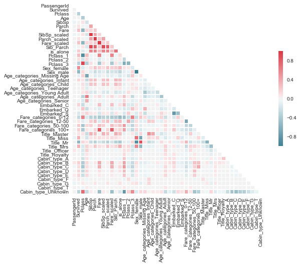

# Predicting Survival of Titanic Passengers Using Machine Learning
This repository includes my exploratory data analysis, feature engineering, model selection,
parameter selection, and final accuracy score for a popular Kaggle competition on
determining the survival rate of the Titanic passengers based on the their class,
sex, cabin fare, and other features.

## Data

I got the data from [Kaggle's Prediction Competition](https://www.kaggle.com/c/titanic),
in which other Kaggle users compete to create a machine learning model that will
most accurately predict which Titanic passengers survived based on data known for
all passengers.  The raw data given for each passenger included 'PassengerId',
'Survived', 'Pclass', 'Name', 'Sex', 'Age', 'SibSp', 'Parch', 'Ticket', 'Fare',
'Cabin', and 'Embarked'.

## Exploratory Data Analysis and Feature Engineering

Before doing any feature engineering, I wanted to see if there were any major predictors
for survival based on gender, age, class, fare, and number of family members.

This graph shows that females survived in much higher proportions than males did,
which makes sense because women and children were given life boats first; therefore
over 70% of women survived while only 20% of men survived.

This graph shows that 60% of passenger class 1 survived, over 40% of passenger class
2 survived, and a little over 20% of passenger class 3 survived.

This graph shows two histograms to compare visually those that survived versus those
who died across different age ranges; in some age ranges, more passengers survived
such as the children.

This graph shows that the cheaper your ticket, the greater likelihood your chance
of dying.

I found that there were null values in the 'Fare', 'Age', and 'Embarked' columns
where 'Embarked' is the location the passenger embarked from.  I dealt with the
null Fare values by filling them with the mean of the fare value.  For the null values
in the 'Embarked' column, I replaced them with 'S', which was the most common location
that passengers embarked from, and for the null age values, I replaced them with
'missing' as I wasn't sure how to predict an age.  I was able to process all these
null values with my process_missing_vals function.

For analysis and visualization purposes, I labeled each passenger as infant, child,
teenager, young adult, adult, senior, or missing age depending on their given age.  
I also labeled each passenger according to the range in fare they paid with the
labels being "0-12", "12-50", "50-100", and "100+".

This graph shows that infants had a 70% chance of living, teenagers had the second
highest chance at 40%, and seniors had the lowest chance at 20%.

To get a better idea of how class determined survival, I created a column with each
passenger's title and a column for each passenger's cabin type using my extract_titles
and extract_cabin_type functions.  I then scaled my numeric columns, such as 'SibSp',
'Parch', and 'Fare' using the minmax_scale, which subtracts each feature value by
the feature's minimum value and then divides that difference by the feature's range;
this essentially makes it so that differences in units of measurement will not influence
my model when I feed it my data.

These two graphs show that a passenger was much more likely to have died if he/she
didn't have any siblings/spouses or parents/children; therefore I combined 'SibSp'
and 'Parch' so that I can then create a column to show whether or not a passenger
was alone or not using my is_alone function.

Before modeling, I quantified my categorical columns, such as 'Pclass', 'Sex', 'Age_categories',
'Embarked', 'Fare_categories', 'Title', 'Cabin_type', so that I could use these
features in my model.  

This heatmap showed that a lot of columns that I made from feature engineering
are highly correlated with the features that they were made from, such as SibSp_scaled
and SipSp, Parch and Parch_scaled, Fare and Fare_scaled, etc.  Also, I noticed
that Title_Mr and Sex_male are extremely highly correlated, that Sex_male and
Sex_female are extremely highly inversely correlated, and that the other titles
show a high correlation with sex_male and sex_female.  This helps me figure out
which columns to drop so that I don't have too much co-linearity between features.

## Model Selection and Parameter Selection

#the select_features function uses a RandomForestClassifier to get the best features
optimized_columns = select_features(train)
grid_searched = select_model_tune(train, optimized_columns)
#without taking out any columns before optimizing, we got a 83.7% on the RandomForestClassifier
best_rf_model = grid_searched[2]['best_estimator']
create_submission(best_rf_model,optimized_columns,filename = 'submission_final.csv')

for df in [train,holdout]:
    df = df.drop(['Pclass','Name','Sex','Sex_male','Age','Age_categories',
                'Fare_categories','Fare_categories','Cabin_type','SibSp',
                'SibSp_scaled','Parch','Parch_scaled','Sib_Parch','Fare',
                'Fare_scaled','Cabin','Embarked','Title'], axis = 1, inplace = True)

optimized_columns = select_features(train)
grid_searched = select_model_tune(train, optimized_columns)
#this got a best of 82.9% on the RandomForestClassifier so I might choose to
keep all the columns anyway, though I am afraid that I'm overfitting.
'''

## Results

## References
